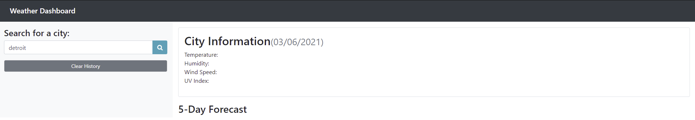

# weather-dashboard

# Unit 6 Server-Side-APIs: Weather Dashboard Assignment 

## Description
This assignment is a weather dashboard that runs in the browser and features dynamically updated HTML and CSS. Using the OpenWeather app API to retrieve data and stores that search data to local storage.

## Screenshots

The following images shows the web application's appearance and functionality:

## Deployed Project Location: 
* Page published at: https://almurawski15.github.io/weather-dashboard/

